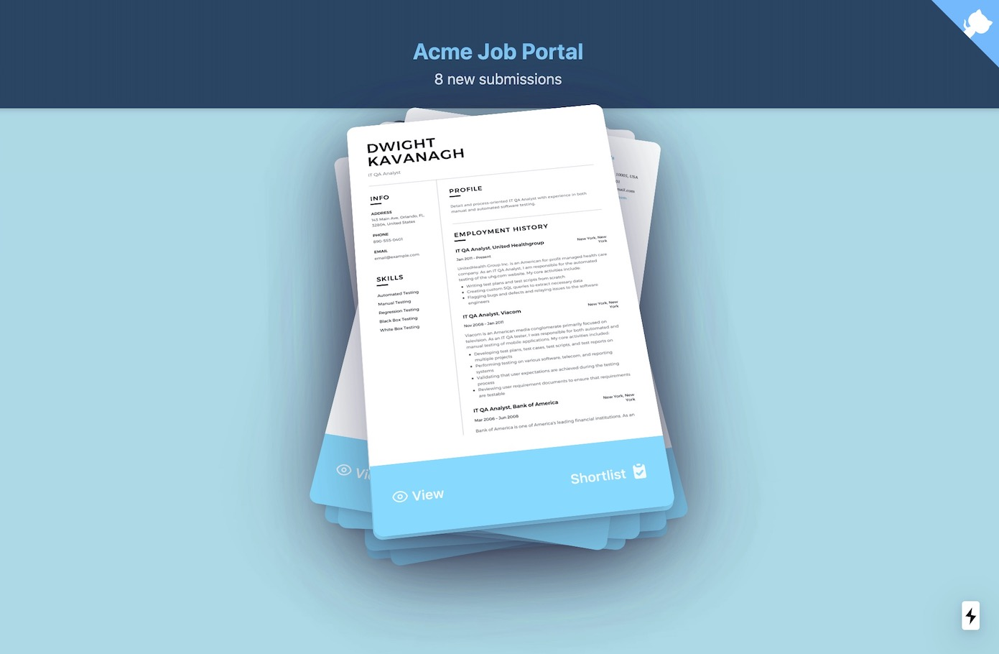

## Acme Job Portal

Another experiment with Tailwind CSS. This time, I'm taking it to adjust the card deck component from react-use-gesture example (see: https://use-gesture.netlify.app/docs/examples).

For this experiment, the card deck is used to show list of resume files (pdf). The pdf is hosted at cloudinary to take advantage of pdf-to-image conversion.

An API endpoint to is also created to simulate fetching of new resume submissions (`pages/api/submissions/list.js`).

Visit this URL to play around with the app:

https://acme-job-portal.wzulfikar.vercel.app

---

**Honorable Mentions:**

- react-use: https://github.com/streamich/react-use
- React Spring: https://github.com/react-spring/react-spring
- React Icons: https://github.com/react-icons/react-icons
